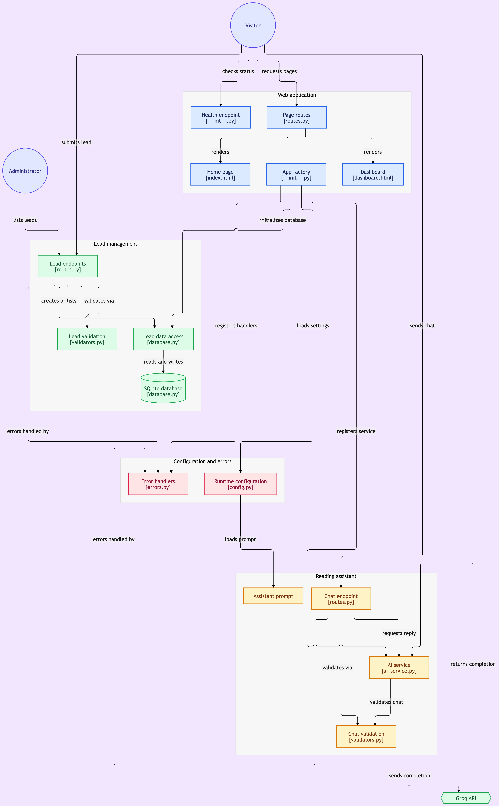

# Gün Arası | SmartLead AI

Yoğun gündelik yaşamda kısa okuma molalarına alan açmayı amaçlayan, yapay zekâ destekli okuma rehberi ve okuyucu kayıt sistemi.

Bu proje, SmartLead AI eğitim yönergesindeki sohbet ve müşteri adayı (lead) toplama mimarisinin dijital okuma fikrine uyarlanmış MVP sürümüdür.

**Geliştirici:** Derya Yıldırım

## Bağlantılar

- Wix sitesi: https://justbluee99.wixsite.com/daily-read
- Backend: https://smartlead-ai-evha.onrender.com
- Canlılık kontrolü: https://smartlead-ai-evha.onrender.com/health

## Çalışan özellikler

- Kullanıcının ilgisine ve ayırabildiği süreye göre demo okuma serisi öneren sohbet asistanı.
- Sohbet sırasında gönderilen konuşma geçmişi üzerinden bağlamın korunması.
- Ad, e-posta, telefon, seri tercihi ve isteğe bağlı mesaj içeren kayıt formu.
- Form kayıtlarının Flask API aracılığıyla SQLite veritabanına kaydedilmesi.
- Okuyucu kayıtlarının Wix Repeater ile yönetim panelinde listelenmesi ve yenilenmesi.
- Veri doğrulama, merkezi hata yönetimi ve kullanıcıya anlaşılır yanıtlar.
- Yönetim işlemleri için erişim kontrolleri.

Otomatik e-posta gönderimi, beğenilere göre öğrenen kişiselleştirme bu sürümde bulunmamaktadır. 

## Teknolojiler

| Katman | Teknoloji |
| --- | --- |
| Kullanıcı arayüzü | Wix Editor, Wix Forms, Wix Repeater |
| Arayüz entegrasyonu | Wix Velo / JavaScript ve backend web modülleri |
| Backend | Python 3.12, Flask, Flask-CORS |
| Veritabanı | SQLite |
| Yapay zekâ | Groq API; model yapılandırmadan seçilir |
| Yayınlama | GitHub, Render, Gunicorn |

## Mimari ve sorumlulukların ayrılığı

İstek akışı: **Wix arayüzü → Velo backend modülü → Flask API → ilgili servis/veri katmanı**.

| Dosya | Sorumluluk |
| --- | --- |
| `run.py` | Uygulamanın giriş noktası |
| `config.py` | Ortam değişkenleri ve geliştirme/üretim ayarları |
| `app/__init__.py` | `create_app()` ile uygulama, servis, CORS ve Blueprint kurulumu |
| `app/routes.py` | HTTP isteklerini karşılayıp ilgili katmana yönlendirme |
| `app/database.py` | SQLite bağlantısı, tablo kurulumu, kayıt ekleme ve listeleme |
| `app/services/ai_service.py` | Groq iletişimi ve yapay zekâ yanıtlarının üretilmesi |
| `app/validators.py` | İstek verilerinin doğrulanması |
| `app/errors.py` | Hataların uygun HTTP/JSON yanıtlarına dönüştürülmesi |
| `constants.py` | Ortak sabitler ve mesajlar |

SQL işlemleri veri katmanında, yapay zekâ çağrıları AI servisinde tutulur. Rotalar bu katmanları çağırır. AI servisi, uygulama fabrikasından kendisine verilen ayarlarla oluşturulur; uygulamaya ait servis `app.extensions` üzerinden kullanılır.

Wix tarafında sohbet, kayıt oluşturma ve yönetim işlemleri Velo kodlarıyla yürütülür. Wix editöründe tutulan bu kodlar, Python deposundan ayrı bir yayınlama ortamına sahiptir.

## Yerel kurulum

Python 3.12 ve Git gereklidir. Depoyu klonlayın; aşağıdaki ilk komutta adresi kendi GitHub depo adresinizle değiştirin:

```bash
git clone <GITHUB_DEPO_ADRESI> smartlead_ai
cd smartlead_ai
python3.12 -m venv .venv
source .venv/bin/activate
python -m pip install -r requirements.txt
```

Proje kökünde `.env` dosyası oluşturun. Aşağıdaki örnekteki yer tutucuları kendi değerlerinizle değiştirin:

```dotenv
APP_ENV=development
SECRET_KEY=BURAYA_RASTGELE_UZUN_BIR_GIZLI_DEGER
AI_PROVIDER=groq
GROQ_API_KEY=BURAYA_GROQ_API_ANAHTARI
GROQ_MODEL=openai/gpt-oss-20b
ADMIN_API_KEY=BURAYA_AYRI_UZUN_BIR_YONETICI_ANAHTARI
CORS_ORIGINS=http://localhost:5000
```

Veritabanı yolu ve ek ayarlar için `config.py` içindeki tanımları esas alın. Örnekteki değerler gerçek anahtar değildir; gerçek anahtarları README'ye veya GitHub'a eklemeyin. Model erişimi Groq hesabına bağlıdır; erişilebilir model adını yapılandırmada kullanın.

Uygulamayı başlatın:

```bash
python run.py
```

Varsayılan yerel adres: `http://localhost:5000`. Çalışan port için terminal çıktısını kontrol edin. Veritabanı başlangıç kurulumu uygulama fabrikasında `init_db(app)` ile yapılır.

## API uç noktaları

| Metot | Yol | İşlev |
| --- | --- | --- |
| GET | `/health` | Canlılık kontrolü |
| POST | `/api/sohbet` | Mesaj ve konuşma geçmişinden yanıt üretme |
| POST | `/api/leads` | Doğrulanmış okuyucu kaydı oluşturma |
| GET | `/api/leads` | Yetkili kayıt listeleme |
| GET | `/` | Flask karşılama şablonu |
| GET | `/dashboard` | Flask yönetim şablonu; üretimde kapalı tutulabilir |

Ziyaretçiye sunulan ana arayüz Wix sitesidir. Üretimde yönetim işlemleri Wix yönetim sayfasından yürütülür. API yanıtları `basari` alanı içerir; sohbet yanıtı `cevap`, kayıt listesi `leadler` alanındadır.

Örnek sohbet isteği:

```bash
curl -X POST http://localhost:5000/api/sohbet \
  -H 'Content-Type: application/json' \
  -d '{"mesaj":"İki dakikam var, mizahi metinleri seviyorum. Hangi seriyi önerirsin?","gecmis":[]}'
```

## Yayınlama

Render servisi GitHub deposuna bağlanır.

- Build komutu: `pip install -r requirements.txt`
- Start komutu: `gunicorn run:app`
- Ortam: `APP_ENV=production`
- Gerekli gizli değerler Render ortam değişkenlerinde tutulur.
- Velo backend modüllerindeki API adresi canlı Render adresine ayarlanır.
- İzin verilen origin değerleri yayımlanmış Wix adresiyle eşleştirilir.
- Yönetici anahtarı Wix Secrets Manager'da saklanır; tarayıcıya gönderilmez.


## Sonraki aşamalar

- Kullanıcının seçtiği gün ve saatte e-posta gönderimi.
- Kullanım hakları doğrulanmış içerik havuzu.
- Beğenilere göre kişiselleştirilmiş tematik seçkiler.
- Kalıcı veritabanı, gönderim takibi ve kullanıcı tercih yönetimi.

Bu özellikler yol haritasıdır; mevcut demo kapsamına dâhil değildir.

## Mimari şema




## Demo videosu


[](https://gitdiagram.com/deryayildirimm/smartlead-ai/video)

## Sunum Videosu

https://www.loom.com/share/23b678a69f0a4992a48455f011166d19
